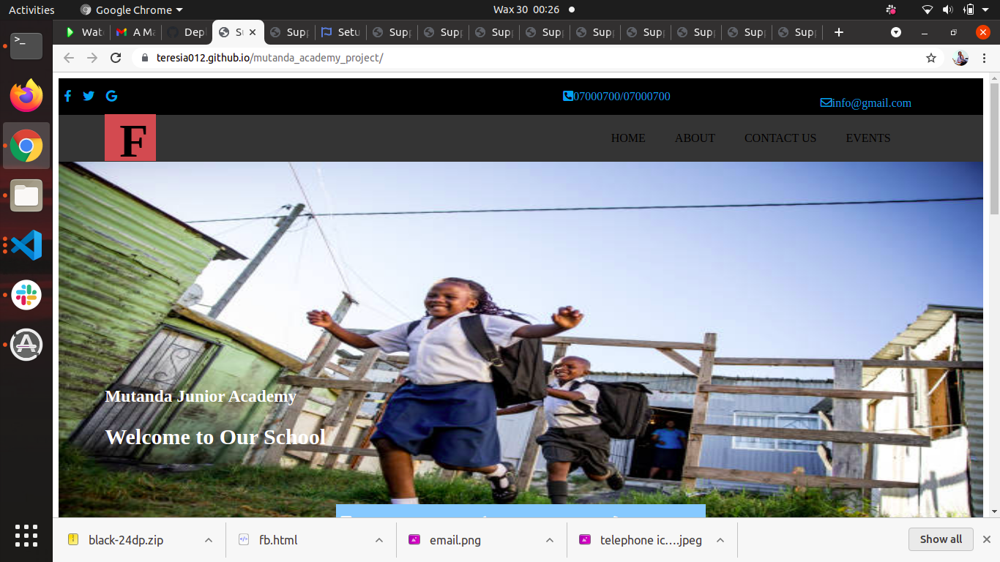
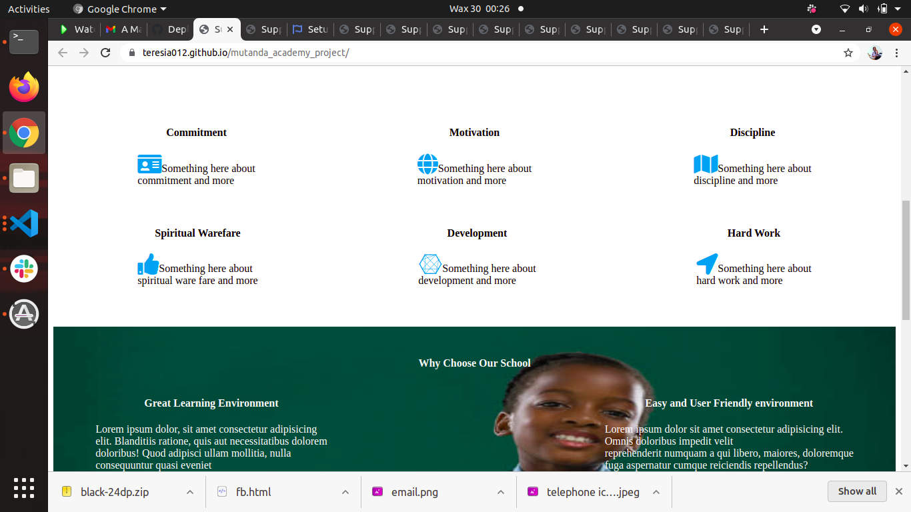
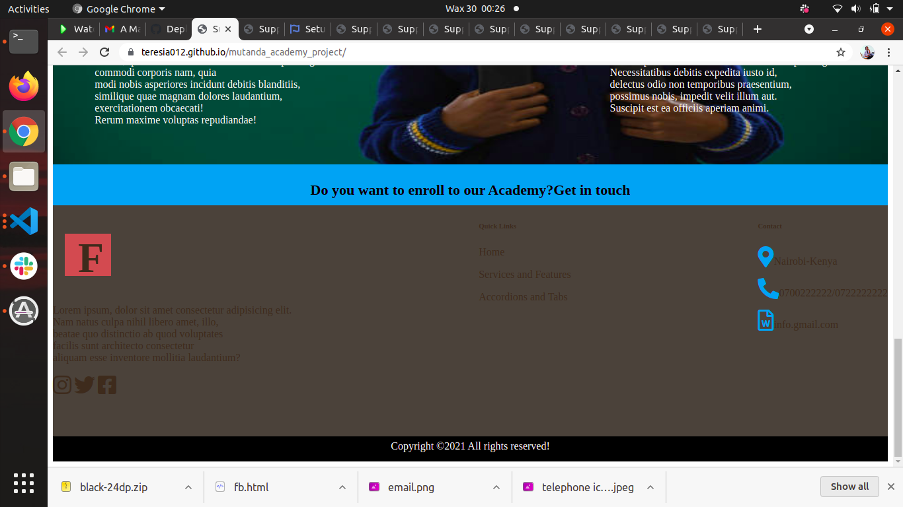

# The project was done by Teresia Wairimu .
## The project is about a school website. It contains images and icons .The school  is known as Mutanda Academy and the website has details of:
* contacts
* location
* home
* about us
* events.
# Instructions;
* Should be run on Chrome
* Use of internet
## Technologies used;
* CSS
* HTML
# Images of the website

